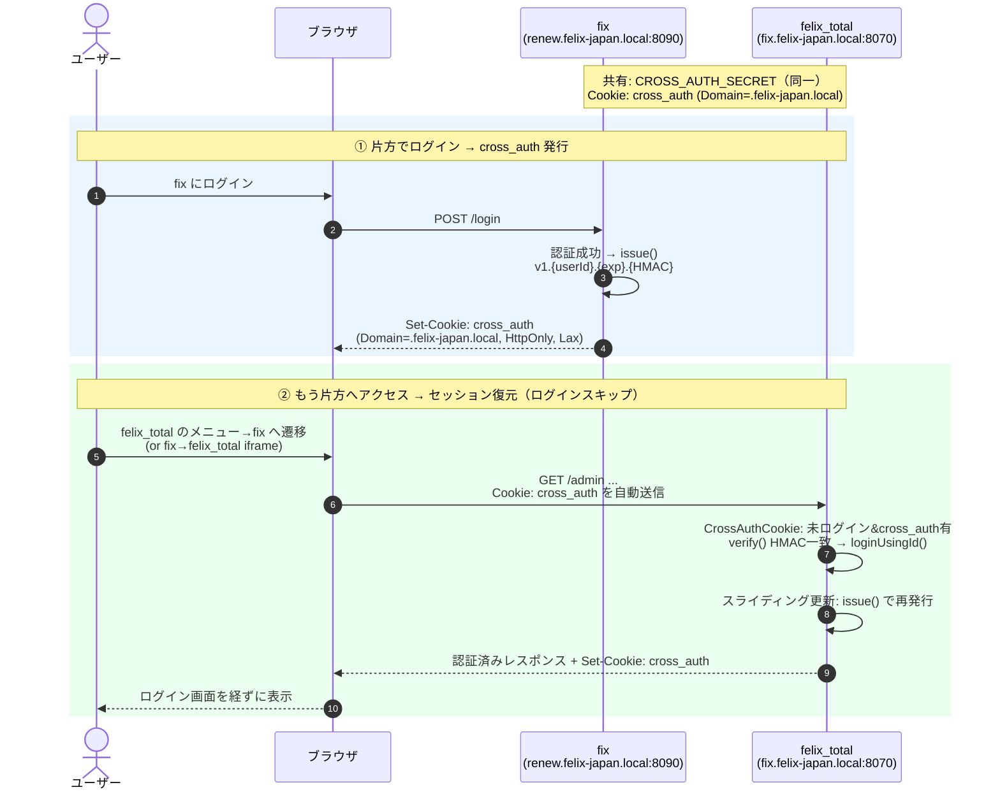

# new_felix_total（FELIX 実行予算）

FELIX の実行予算管理を担う Web アプリケーション。既存 `felix_total` の
MySQL（`fix_db`）を参照し、実行予算の一覧・検索・原価/予算の表示を行う。

Laravel 13（PHP 8.3）をバックエンド、Vue 3 + Inertia.js + TypeScript を
フロントエンドとする **Monolith SPA**（Inertia.js）構成。

> 🛑 **実装前に必ず [`CLAUDE.md`](CLAUDE.md) と [`docs/architecture/`](docs/architecture/README.md) を読むこと。**
> アーキテクチャドキュメントを唯一の正（Single Source of Truth）として扱う。

## 技術スタック

| レイヤ | 採用技術 |
| --- | --- |
| 言語 (BE) | PHP 8.3 |
| FW (BE) | Laravel 13 |
| 言語 (FE) | TypeScript |
| FW (FE) | Vue 3.5+ / Inertia.js 3.x |
| UI | shadcn-vue / reka-ui / Tailwind CSS 4 |
| ビルド | Vite |
| ルーティング型 | Laravel Wayfinder |
| テスト | PHPUnit 12 |
| Lint/Format | Laravel Pint |
| CI/CD | GitHub Actions |

## 必要環境

- PHP 8.3 / Composer
- Node.js 22+ / npm
- Docker Desktop（Docker 開発する場合）
- 接続先の MySQL（既存 `felix_total` の `fix_db`。ホスト `3307` 公開を想定）

## セットアップ

### A. Docker で開発（推奨 / Windows・Mac 共通）

事前に `felix_total` を docker 起動し、MySQL をホスト `3307` に公開しておく。

```bash
cp .env.example .env
docker compose up -d --build
# アプリ: http://localhost:8090/   （Vite HMR: http://localhost:5173/）
```

詳細・トラブルシュートは [`docs/docker-development.md`](docs/docker-development.md)。

### B. ホストで直接開発

```bash
composer install
cp .env.example .env
php artisan key:generate
npm install
composer run dev   # server / queue / logs / vite を同時起動
```

`.env` の `DB_HOST=127.0.0.1` / `DB_PORT=3307` で `fix_db` に接続する。

## felix_total ⇄ fix の Cookie 同期（認証連携）

実行予算明細の **iframe 埋め込み**（fix → felix_total の `/admin` 編集画面）と、
felix_total から fix へ戻る **メニューリンク**で、両システムが**同一ログインを共有**する。
仕組みは**同期クッキー方式（`cross_auth`）**：親ドメイン（`.felix-japan.local`）に
発行した「`userId` の平文＋HMAC 署名」クッキーを両サブドメインで読み書きし、
未ログイン側のミドルウェア（[`app/Http/Middleware/CrossAuthCookie.php`](app/Http/Middleware/CrossAuthCookie.php)）が
署名を検証して自前セッションを復元する。**設計の正は [`docs/plans/cross-auth-cookie-plan.md`](docs/plans/cross-auth-cookie-plan.md)。**



> 共有の根拠は **`CROSS_AUTH_SECRET` の一致**のみ。両アプリで同じ値だから署名検証が通り、相互に信用してログインする（不一致だと SSO が成立しない）。

### ローカル検証の前提（最重要）

クッキーは親ドメイン単位で共有されるため、**両アプリをサブドメインで開く**こと。
`localhost:8090` で開くと `cross_auth`（`Domain=.felix-japan.local`）が送られず、
frame-ancestors（後述）も一致しないため**認証共有も iframe 表示も成立しない**。

| システム | アクセス URL |
| --- | --- |
| fix（本リポジトリ） | `http://renew.felix-japan.local:8090` ← **localhost では開かない** |
| felix_total（現行） | `http://fix.felix-japan.local:8070` |

#### 1. hosts に2サブドメインを登録

```
# /etc/hosts （macOS/Linux） … Windows は C:\Windows\System32\drivers\etc\hosts
127.0.0.1  renew.felix-japan.local  fix.felix-japan.local
```

#### 2. fix 側 `.env`

```env
# 現行 felix_total（iframe 先）の URL
FELIX_TOTAL_URL=http://fix.felix-japan.local:8070

# 同期クッキー。★felix_total と「完全に同じ値」にする（一致しないと認証共有が壊れる）
CROSS_AUTH_SECRET=<felix_total と共通の秘密鍵>
# 両サブドメインの共通親（本番は .felix-japan.co.jp 等）
CROSS_AUTH_DOMAIN=.felix-japan.local
CROSS_AUTH_TTL=1800
# ローカル http 検証は false。本番(HTTPS)は true
CROSS_AUTH_SECURE=false
```

#### 3. felix_total 側で必要な対応(実装済みなので、最新を取得し、dockerを起動させてください)

| 項目 | 対応 |
| --- | --- |
| `CROSS_AUTH_SECRET` | **fix と一致**させる（SSO の信頼の根拠） |
| `CrossAuthCookie` ミドルウェア | admin ガードで `cross_auth` を復元/発行（fix と対） |
| `EncryptCookies` | `cross_auth` を `$except` に追加（平文＋HMAC のため） |
| **frame-ancestors（iframe 許可）** | `/admin`（最低 `?iframe=on`）応答に `Content-Security-Policy: frame-ancestors 'self' http://renew.felix-japan.local:8090` を付与し `X-Frame-Options` を緩和。**アプリ内ミドルウェアで /admin 限定**（サーバ全体ヘッダにしない） |

### 動作確認

1. `http://renew.felix-japan.local:8090/estimates/{id}` を開いてログイン。
2. 明細リンク → モーダル iframe に felix_total の `/admin` 編集画面が表示される。
3. felix_total(`fix.felix-japan.local:8070`)のメニューから fix へ遷移すると**ログインがスキップ**される（＝`cross_auth` SSO が成立）。
4. DevTools > Application > Cookies に `cross_auth`（`Domain=.felix-japan.local` / `HttpOnly` / `SameSite=Lax`）。

### トラブルシュート

| 症状 | 原因 / 対処 |
| --- | --- |
| `サーバーの IP アドレスが見つかりません`（`ERR_NAME_NOT_RESOLVED`） | hosts 未登録 or `.test`/`.local` 不一致。hosts を確認し DNS フラッシュ |
| `接続が拒否されました`＋Console に `frame-ancestors ... violates` | 親を `localhost:8090` で開いている。`renew.felix-japan.local:8090` で開く |
| iframe URL が古い TLD のまま | ブラウザのフルリロード（Cmd+Shift+R）。直らなければ `docker exec new_fix_dev php artisan optimize:clear` 後にコンテナ再起動 |
| iframe 内で `/admin/auth/login` に飛ぶ | `cross_auth` が送られていない or `CROSS_AUTH_SECRET` 不一致。Cookie 送信と両アプリの secret 一致を確認 |

## 業者への通知メール（メールキュー）

業者へのメールは**その場で送信せず、メールキューのテーブル `mail_queues` へ予約登録**する
（現行 felix_total の送信処理を踏襲）。実際の配信は同テーブルを見る**既存のメール送信バッチ**が行う。
本文は blade（`resources/views/mail/notification/body.blade.php`）を描画した HTML をそのまま入れる。

`mail_queues` は**本体とは別のデータベース**（現行と同じ `itplus4_list`）にあり、
`config/database.php` の `mysql_2` 接続を使う。**接続先はコードに持たず、すべて `.env` で指定する。**

| `.env` のキー | 内容 |
| --- | --- |
| `DB_HOST_2` | メールキューDBのホスト |
| `DB_PORT_2` | ポート（既定 3306） |
| `DB_DATABASE_2` | データベース名（`itplus4_list`） |
| `DB_USERNAME_2` / `DB_PASSWORD_2` | 接続ユーザー |

**本番では本番用の `.env` を用意して切り替える。** コード側の変更は不要
（`config/database.php` / `config/mail_queue.php` は `env()` を読むだけで接続先を直接持たない）。
社内のメールキューDBへ開発環境から接続する場合は **VPN 接続が必要**。

### メールの設定（`config/mail_queue.php`）

| `.env` のキー | 既定値 | 内容 |
| --- | --- | --- |
| `MAIL_QUEUE_CONNECTION` | `mysql_2` | キューDBの接続名 |
| `MAIL_QUEUE_TABLE` | `mail_queues` | キューのテーブル名 |
| `MAIL_QUEUE_FROM_MAIL` | `info@felix-japan.co.jp` | 差出人アドレス |
| `MAIL_QUEUE_FROM_NAME` | `フィリックス株式会社` | 差出人名（件名の【】内にも使う） |
| `MAIL_QUEUE_SEND_DELAY_MINUTES` | `10` | 送信予約の猶予（分） |
| `MAIL_QUEUE_TIMEZONE` | `Asia/Tokyo` | `send_time` を書くタイムゾーン。**キューDB・送信バッチに合わせる**（本アプリは UTC のため、揃えないと猶予を待たず送信される） |
| `MAIL_QUEUE_VENDOR_BASE_URL` | `FELIX_TOTAL_URL` | 業者マイページの基点 URL |
| `MAIL_QUEUE_OVERRIDE_TO` | 空 | **テスト送信先**。設定すると全宛先をこのアドレスへ差し替える。**本番では必ず空にする** |
| `MAIL_QUEUE_BILLING_ORDER_PREVIEW_URL` | 空 | ⑧ 発注確定メールの発注書プレビュー URL。未設定の間は ⑧ を送信しない |

> **動作確認するときは必ず `MAIL_QUEUE_OVERRIDE_TO` を設定する。**
> `mail_queues` は本番共有のキューで、`status = 0` で積むと送信バッチが実際に配信する。

## よく使うコマンド

| 目的 | コマンド |
| --- | --- |
| 開発サーバー一括起動 | `composer run dev` |
| 本番ビルド | `npm run build` |
| 型チェック | `npm run type-check` |
| テスト | `php artisan test` |
| コードスタイル検査 / 整形 | `./vendor/bin/pint --test` / `./vendor/bin/pint` |

## ディレクトリ構成（抜粋）

```
app/            … Laravel アプリ（Controllers / Requests / Repositories ...）
config/         … 設定（status_management 等）
resources/js/   … フロントエンド（Vue / Inertia / TypeScript）
  components/    … 再利用コンポーネント（BudgetTable, CostTable ...）
  pages/         … Inertia ページ（Estimate, ExecutionBudget ...）
  composables/ , lib/ , types/
routes/         … ルート定義
docs/           … アーキテクチャ / デプロイ / CI-CD ドキュメント
.github/workflows/ … CI/CD（GitHub Actions）
```

## ブランチ戦略とデプロイ

| ブランチ | 役割 | デプロイ先 | サーバー |
| --- | --- | --- | --- |
| `main` | 本番 | 本番環境 | さくらのレンタルサーバー |
| `staging` | 社内検証 | 検証環境 | 社内 Windows サーバー（Docker） |
| `develop` | 開発 | 開発環境 | 開発サーバー（Docker） |

各ブランチへ **push / マージ** すると GitHub Actions が対応環境へ自動デプロイする。
全 PR では CI（Lint・型チェック・テスト・ビルド）が走る。

詳細・必要な Secrets / Variables・有効化手順は [`docs/cicd.md`](docs/cicd.md)。

## ドキュメント

| ドキュメント | 内容 |
| --- | --- |
| [`CLAUDE.md`](CLAUDE.md) | 開発ガイド / 実装前の必須確認 |
| [`docs/architecture/README.md`](docs/architecture/README.md) | 全体アーキテクチャ・技術スタック |
| [`docs/architecture/frontend.md`](docs/architecture/frontend.md) | フロントエンド（Vue / Inertia / TS） |
| [`docs/architecture/backend.md`](docs/architecture/backend.md) | バックエンド（Laravel / PHP） |
| [`docs/plans/cross-auth-cookie-plan.md`](docs/plans/cross-auth-cookie-plan.md) | felix_total ⇄ fix の Cookie 同期（認証連携）設計 |
| [`docs/docker-development.md`](docs/docker-development.md) | Docker 開発環境ガイド |
| [`docs/deploy.md`](docs/deploy.md) | 社内サーバー Docker デプロイ手順 |
| [`docs/cicd.md`](docs/cicd.md) | CI/CD（GitHub Actions）ガイド |
