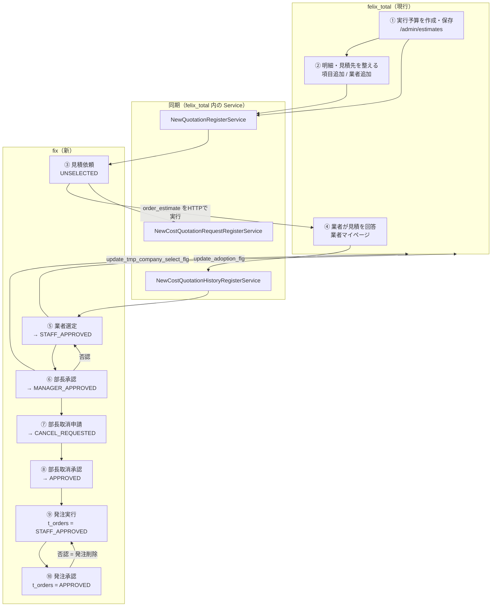

# 実行予算の作成 〜 発注承認 運用フロー

> felix_total（現行 / Laravel 8 + laravel-admin）で **実行予算** を作成してから、
> fix（新 / Laravel 13 + Inertia + Vue3）の **発注承認** に至るまでの、
> 業務操作・データ同期・ステータス遷移を一本につないだ運用フロー。
>
> 記載はすべて現行コードから起こしたもの（2026-08 時点）。実装との差異が出た場合は、
> 本書を先に更新してから実装すること（Single Source of Truth）。
>
> 関連: [見積管理 詳細設計](../detailed-design/quotations/00_共通仕様_詳細設計.md) /
> [実行予算 移植計画](../plans/execution-budget-migration-plan.md)

---

## 1. 前提

### 1.1 2システムの役割分担

| | felix_total（現行） | fix（新） |
| --- | --- | --- |
| 位置づけ | **データの発生源**。実行予算・明細・見積先・業者見積の登録はすべてここ | **申請／承認のワークフロー画面**。見積依頼〜発注承認を担当する |
| 見るテーブル | 旧テーブル（`estimates` / `estimate_units` / `estimate_unit_companies` …） | 新テーブル（`t_buildings` / `t_building_budget_items` / `t_payable_partners` …） |
| DB | **同一 MySQL の同一スキーマ（`fix`）**。新旧テーブルが同居する | 同左 |

- 新旧テーブルは **`source_id`（＝旧テーブルの PK）** で 1:1 に突合する。
- 新テーブルへの書き込みは felix_total 側の `App\Services\New*RegisterService` が行う
  （fix は自分で建物・項目・見積先を作らない）。
- 逆に fix の承認操作は、**新テーブルを更新したうえで felix_total の既存処理をサーバ間 HTTP で呼ぶ**
  （`FelixTotalQuoteRequestGateway`）。両方書けたときだけ成功扱い（片方失敗ならロールバック）。

### 1.2 新旧テーブル対応

| 旧（felix_total） | 新（fix が参照） | 意味 |
| --- | --- | --- |
| `estimates` | `t_buildings` | 建物 / 実行予算 |
| `estimate_units`（`step=2` かつ `sub_cate=2`） | `t_building_budget_items` | 建設費用項目 |
| `estimate_units.group` | `t_building_cost_item_groups` | 項目の見積グループ（A/B/C/D） |
| （新規） | `t_building_group_statuses` | 建物の見積グループ状態（A/B/C/D の4件） |
| `estimate_unit_companies` | `t_payable_partners` | 費用見積（＝見積先1社） |
| `estimate_order_histories` | `t_payable_quotation_requests` | 見積依頼の送信履歴 |
| `estimate_unit_company_files`（`type=1`） | `t_payable_quotations` | 業者の見積回答（最新は `is_latest`） |
| `cost_unit_estimate_units` | `t_payable_quotation_details` | 見積明細 |
| （fix 独自） | `t_orders` / `t_delivery_reports` / `t_invoices` | 発注 / 完了報告 / 請求 |
| （fix 独自） | `t_comments` / `t_attachments` | やり取り（チャット）・添付 |

> **同期対象は「建設明細」だけ**。`estimate_units.step = 2`（本実行予算）かつ `sub_cate = 2`（建設）
> 以外の明細は新テーブルへ一切流れない。土地原価・金融融資などが fix に出てこないのはこのため。

### 1.3 登場ロール

| ロール | slug（既定） | 主に触る画面 |
| --- | --- | --- |
| 担当者（建設部 / システム開発） | `engineer` / `system` | 見積依頼・業者選定・部長取消申請・発注実行 |
| 部長（建設部部長 / 建設承認） | `engineer_manager` / `tmp` | 部長承認・部長取消承認・発注承認・発注取消承認 |
| 管理者 | `administrator` | 全画面 |
| 業者 | （`web` ガード） | felix_total の業者マイページで見積を回答 |

ロール → メニューの対応は `config/felix.php` の `menu_roles` が唯一の正。

---

## 2. 全体フロー



テキスト版:

```
felix_total 実行予算作成
        │（自動同期）
        ▼
fix 見積依頼 ──▶ 業者回答（felix_total） ──▶ fix 業者選定 ──▶ 部長承認
                                                  ▲             │
                                                  └──否認差戻し──┘
                                                                │
        部長取消申請 ──▶ 部長取消承認 ──▶ 発注実行 ──▶ 発注承認 ──▶（以降：業者承諾 → 完了確認 → 請求）
                                                        ▲          │
                                                        └──否認────┘
```

---

## 3. ステータス定義

### 3.1 費用見積 `t_payable_partners.approval_status`

| 値 | 表示上の意味 | 遷移させる操作 | 出現する fix 画面 |
| --- | --- | --- | --- |
| `UNSELECTED` | 未選定（既定値） | （作成時）／部長承認の否認で戻る | 見積依頼・業者選定 |
| `STAFF_APPROVED` | 担当承認済（部長承認待ち） | 業者選定の「発注業者を確定」 | 部長承認 |
| `MANAGER_APPROVED` | 部長承認済 | 「部長承認」 | 部長取消申請 |
| `CANCEL_REQUESTED` | 取消申請中 | 「取消申請」（理由必須） | 部長取消承認 |
| `APPROVED` | 承認完了（コード上の注記は「設計部承認済」） | 「取消承認」（理由必須） | **発注実行** |

その他の列: `is_drafted`（仮選定フラグ）、`deny_comment`（部長承認の否認理由）。

### 3.2 発注 `t_orders.order_status`

| 値 | 意味 | 遷移させる操作 |
| --- | --- | --- |
| `STAFF_APPROVED` | 担当者が発注実行済（部長承認待ち） | 発注実行（レコード作成） |
| `APPROVED` | 発注承認済 | 発注承認 |
| `CANCEL_REQUESTED` | 発注取消申請中 | 業者承諾確認画面の「取消申請」 |
| （レコード削除） | 否認 / 取消承認 | 発注承認の否認・発注取消承認 |

承認の足跡は `t_order_approval_actions`（`step_name` = `STAFF`/`MANAGER`、`action_type` =
`SELECT`/`APPROVE`/`REJECT`/`CANCEL_SUBMIT`/`CANCEL_APPROVE`）に1件ずつ残る。

---

## 4. フェーズ別の運用手順

### ① 実行予算の作成（felix_total）

**操作**: `/admin/estimates`（実行予算）で仮予算（`tmp_budget`）を指定して新規作成・保存。

**内部処理**（`EstimateController` の form saved フック）:

1. `GenerateEstimateUnitsFromTmpBudget` が仮予算から `step=2` の明細を生成（既に `step=2` の明細が
   ある場合は生成をスキップ）。共通親ID（`common_parent_id`）を設定。
2. `NewQuotationRegisterService::register($estimateId, $wasRecentlyCreated)` を実行。

**同期結果**（新規作成時 = `insert`）:

| 生成される新テーブル | 内容 |
| --- | --- |
| `t_buildings` | `building_name` = `estimates.name`、`division_code` = 仮予算 → 区画（`land_units.division`） |
| `t_building_group_statuses` | グループ A/B/C/D の4件（`is_completed = false`） |
| `t_building_budget_items` | 対象明細ごとに1件。`item_name` / `sort` / `is_enabled`(`use_flg`) / `master_price` / `budget_price` / `quotation_amount`（採用業者の確定見積） |
| `t_building_cost_item_groups` | `estimate_units.group` を分解して1コード1件 |
| `t_payable_partners` | 明細に紐づく見積先ごとに1件。`approval_status` は既定の `UNSELECTED` |

**更新時（2回目以降の保存 = `update`）**: `source_id` で突合して UPDATE、未登録ぶんは INSERT で補完。
`is_drafted` / `approval_status`（＝fix 独自の項目）は**上書きしない**ので、承認状態が巻き戻ることはない。

> ⚠️ 更新パスでは `t_building_group_statuses` と `t_building_cost_item_groups` を作らない。
> 実行予算の再保存で新しく現れた明細は、費用項目は補完されるが**見積グループのレコードは作られない**。

### ② 明細・見積先を整える（felix_total）

実行予算作成後の各操作にも、それぞれ個別の同期が入っている。

| felix_total の操作 | 実行される同期 | 新テーブルへの反映 |
| --- | --- | --- |
| 実行予算の保存（再保存） | `register(..., false)` | 建物・費用項目・費用見積を洗い替え（金額含む） |
| 項目（工程）の追加<br/>`AddEstimateUnitController::quickStore` | `registerAddCostItemWithRelations` | 費用項目＋見積グループ＋費用見積を追加 |
| 見積先（業者）の追加・編集<br/>`EstimateUnitCompanyController::form` | `syncCostQuotationByCompany` | 費用見積を1件 upsert（親の費用項目が無ければ項目ごと補完） |
| 見積タブの `use_flg` 変更 | `syncCostItemIsEnabled` | `t_building_budget_items.is_enabled` |
| 項目名のインライン編集 | `syncCostItemName` | `t_building_budget_items.item_name` |

> ⚠️ **金額のインライン編集（予算単価・確定見積など）は同期対象外**。
> 単価を直したら実行予算画面で保存し直さないと、fix 側の `budget_price` / `quotation_amount` は古いまま。

> ⚠️ 建物（`t_buildings`）が未登録の状態で項目や見積先だけ追加しても、同期は**何もせずに終了**する。
> 実行予算そのものを一度保存して建物を作るのが先。

### ③ 見積依頼（fix）

- **画面**: 見積依頼【FELIX→業者依頼前】 / **ロール**: 担当者
- **対象**: `source_id` を持つ（＝移行済みの）見積先すべて。`approval_status` には依存しない。
  送信回数（`t_payable_quotation_requests` の件数）が 0 の行が「未依頼」、1以上は再依頼可。

**操作**:

1. 依頼したい業者の行に「仮選定」を付ける（`is_drafted` を即時保存。あくまで印で、状態遷移はしない）。
2. 「見積依頼」をチェック → ヘッダーの **［見積依頼送信］** で一括送信。

**内部処理**:

1. fix が見積先を旧 ID へ写像し、`"{estimate_units.id}:{estimate_unit_companies.id}"` の配列を作る。
2. `FelixTotalQuoteRequestGateway::orderEstimate()` が **felix_total の `order_estimate` を
   サーバ間 HTTP で実行**（認証は `cross_auth` クッキーを fix 側で発行して付与）。
3. felix_total 側でトークン発行 → `estimate_order_histories` に履歴を作成 → 業者へ依頼メール送信。
4. 同 controller 内で `NewCostQuotationRequestRegisterService::register()` が走り、
   `t_payable_quotation_requests` へ依頼履歴を同期（`requested_at` = 履歴の作成日時）。

> `source_id` の無い見積先（fix 側だけに存在する行）は felix_total へ依頼できないため送信対象外。
> 依頼の同期に失敗しても**例外は再送出せずログのみ**（旧テーブル側の業務保存を止めない設計）。

### ④ 業者の見積回答（felix_total 業者マイページ）

- 業者が見積依頼メールのリンクから業者マイページへログインし、金額・明細・ファイルを登録して保存。
- `EstimateController::save` が `estimate_unit_company_files`（`type=1`）と `cost_unit_estimate_units`
  を作成し、続けて `NewCostQuotationHistoryRegisterService::register()` を実行。

**同期結果**:

| 新テーブル | 内容 |
| --- | --- |
| `t_payable_quotations` | 回答1件＝1レコード。`subtotal_amount` / `quotation_date` / `file_url` など。最新1件だけ `is_latest = true`（旧ロジック「`type=1` を date DESC, id DESC の先頭」を鏡写し） |
| `t_payable_quotation_details` | 見積明細 |

fix の一覧では「回答あり」＝`is_latest` の履歴を持つこと、で判定する。

### ⑤ 業者選定（fix）

- **画面**: 業者選定【業者→FELIX返答済】 / **ロール**: 担当者
- **対象**: `approval_status = UNSELECTED`（部長承認で差し戻された行もここに戻る）
- **選定できる行**: 見積回答がある行のみ（回答なしはボタン非活性）

**操作**: 発注したい業者をトグルで選定 → **［発注業者を確定］** で一括確定。

**内部処理**（`recordVendorSelections` / 1トランザクション）:

1. 見積先を旧 ID（`unit` / `company`）へ写像（`source_id` 無しは除外）。
2. `UNSELECTED` の行だけに絞る（二重送信・状態不整合の防止）。
3. `approval_status` を **`UNSELECTED` → `STAFF_APPROVED`** へ UPDATE。
4. felix_total の `update_adoption_flg`（`mode=true`）を呼ぶ＝旧側の採用フラグを立てる。
5. felix_total が失敗したら 3 の UPDATE ごとロールバック。

### ⑥ 部長承認（fix）

- **画面**: 部長承認【業者選定済→FELIX(建設部)】 / **ロール**: 部長
- **対象**: `approval_status = STAFF_APPROVED`

**承認**: 選択 → **［部長承認］** で一括。
`STAFF_APPROVED` → **`MANAGER_APPROVED`**、続けて felix_total の `update_tmp_company_select_flg`
（建設部選定）を呼ぶ。失敗時はロールバック。

**否認**: 行ごとに理由入力モーダル → 1件ずつ実行。
`STAFF_APPROVED` → **`UNSELECTED`**、`deny_comment` に理由を記録し、felix_total の
`update_adoption_flg`（`mode=false`）で採用を取り消す。理由は項目のやり取り（チャット）へ
`【否認】…` として自動投稿され、業者選定画面に「差し戻し」として赤表示で戻る。

### ⑦ 部長取消申請（fix）

- **画面**: 部長取消申請【FELIX(担当者)→FELIX(建設部部長)】 / **ロール**: 担当者
- **対象**: `approval_status = MANAGER_APPROVED`
- **操作**: 行ごとに理由入力モーダル → 1件ずつ **`CANCEL_REQUESTED`** へ。
  理由は `【取消申請】…` としてやり取りへ自動投稿。felix_total 側の呼び出しは無し（新テーブルのみ）。

### ⑧ 部長取消承認（fix）

- **画面**: 部長取消承認【FELIX(建設部部長)→FELIX(担当者)】 / **ロール**: 部長
- **対象**: `approval_status = CANCEL_REQUESTED`
- **操作**: 行ごとに理由入力モーダル → 1件ずつ **`APPROVED`** へ。理由は `【取消承認】…` として投稿。
- **felix_total 連携**: 承認の段を逆順に解除する。
  1. `update_tmp_company_select_flg`（`mode=false`）＝建設部選定の取消
  2. `update_adoption_flg`（`mode=false`）＝採用の取消
  失敗時は新テーブルの更新をロールバック。

> ⚠️ **ここが本フロー最大の要確認点**。画面名・理由入力は「取消」だが、
> 遷移先の `APPROVED` は次の **発注実行の対象条件**でもある（§5 の課題1）。

### ⑨ 発注実行（fix）

- **画面**: 発注実行【承認済み見積→未発注】 / **ロール**: 担当者
- **対象**: `approval_status = APPROVED` **かつ** まだ `t_orders` が無い見積先
- **操作**: 発注する行をチェック → **［発注を実行］**。「発注書」ボタンで felix_total の
  発注書確認画面（`check_company_list`）を iframe 表示できる。

**内部処理**（`executeOrders`）:

- `t_orders` を1件作成: `order_status = STAFF_APPROVED` / `amount` = 最新見積の税別金額 /
  `order_date` = 当日。
- `t_order_approval_actions` に `STAFF` / `SELECT` を記録。

### ⑩ 発注承認（fix）★本フローのゴール

- **画面**: 発注承認【担当者実行済→部長承認待ち】 / **ロール**: 部長
- **対象**: `t_orders.order_status = STAFF_APPROVED` を持つ見積先

**承認**: 選択 → **［発注を承認］** で一括。
`order_status` を **`STAFF_APPROVED` → `APPROVED`**、`t_order_approval_actions` に
`MANAGER` / `APPROVE` を記録。→ 以降は 業者承諾確認 → 完了確認 → 部長完了承認 → 請求 へ続く。

**否認**: 行ごとに理由入力モーダル → 1件ずつ実行。
`t_order_approval_actions` に `MANAGER` / `REJECT` を記録したうえで **発注レコードを削除**する。
削除により見積先は「発注実行待ち」（`approval_status = APPROVED` かつ発注なし）へ戻る。

> ⚠️ `TOrder` は SoftDeletes 非適用のため、否認・取消承認での `delete()` は**物理削除**。
> また発注否認の理由は引数で受け取るだけで**どこにも保存されていない**（§5 の課題3）。

---

## 5. 運用上の注意・要確認事項

### 課題1（要確認・最重要）: `APPROVED` に至る経路が「取消承認」しか無い

`approval_status` を `APPROVED` にする実装は `recordCancelApprovals`（部長取消承認）だけで、
一方の発注実行は `APPROVED` を対象にしている。つまり現状のコードでは
**「取消申請 → 取消承認」を通さないと発注実行の一覧に現れない**。

- コード上の注記は `APPROVED` を「設計部承認済（取消承認＝完了扱い）」としており、
  旧システムの承認段（建設部選定 → 設計部第一承認 → 常務承認）の 3段目に相当する可能性が高い。
- つまり「部長取消申請 / 部長取消承認」の2画面が、実態としては **3段目・4段目の承認**として
  機能している。画面名と業務の意味が食い違っているため、
  **(a) 画面名を承認段に合わせる / (b) 発注実行の対象条件を `MANAGER_APPROVED` にする**
  のどちらが正か、業務側と確定が必要。
- 現行DBの分布（2026-08 時点）: `UNSELECTED` 1,502 / `STAFF_APPROVED` 1 / `MANAGER_APPROVED` 3 /
  `APPROVED` 3。`APPROVED` の3件から発注が作られており、上記の経路で運用されている。

### 課題2: 発注実行・発注承認がサイドメニューに無い

`AppLayout.vue` の「発注管理」メニューは **業者承諾確認 / 発注取消承認** の2画面のみ。
発注実行（`/order-delivery/order-execution`）と発注承認（`/order-delivery/order-approval`）は
ルート・画面ともに実装済みだが**リンクが無い**ため、URL 直打ちでしか到達できない。
発注が作られなければ業者承諾確認以降も動かないため、メニュー追加（`menu_roles` の
`order-management` はロール未設定＝空配列のまま）の要否を確認すること。

### 課題3: 発注否認の理由が保存されない

`OrderDeliveryRepository::rejectOrder($quotationId, $reason)` は `$reason` を未使用のまま発注を削除する。
`t_orders.deny_comment` 列も未使用。見積側の否認（`deny_comment` ＋ やり取りへ自動投稿）と挙動が揃っていない。

### 課題4: `t_orders` 系のマイグレーションがリポジトリに無い

`t_orders` / `t_delivery_reports` / `t_invoices` / 各 `*_approval_actions` は DB には存在するが、
fix・felix_total どちらの `database/migrations` にもファイルが無い（モデルの `@see` は存在しないパスを指す）。
環境の再構築ができないので、マイグレーションを起こして追加すること。

### 課題5: 同期の失敗時の扱いが Service ごとに違う

| Service | 失敗時 |
| --- | --- |
| `NewQuotationRegisterService` | ロールバックのうえ**例外を再送出**（実行予算の保存自体が失敗する） |
| `NewCostQuotationRequestRegisterService` | ロールバックして**ログのみ**（旧側の依頼送信は成立したまま） |
| `NewCostQuotationHistoryRegisterService` | 同上（業者の回答は旧側に残り、fix に出てこない） |

→ 後者2つは「旧側にはあるが fix に出ない」状態が起こり得る。運用では
`Log::warning('…同期をスキップしました…')` の監視、または再同期手段の用意が必要。

### 課題6: その他の運用上の落とし穴

- **同期対象は `step=2` かつ `sub_cate=2` のみ**。fix に項目が出てこない場合、まずここを疑う。
- **金額の反映は実行予算の保存が必要**（§4 ②）。インライン編集だけでは fix に反映されない。
- **fix と felix_total は同一 DB**。fix の画面から iframe で felix_total を開いて編集した場合、
  モーダルを閉じた時点で一覧を部分再取得して反映している。
- **論理削除**: 旧側の `estimate_units` / `estimate_unit_companies` は SoftDeletes のため削除済みは
  同期対象外。ただし**既に同期済みの新テーブル行を削除する処理は無い**ため、
  旧側で削除した明細・見積先が fix に残り続ける可能性がある。

---

## 6. 一覧: 操作 → 画面 → ステータス

| # | 操作 | システム / 画面 | ロール | 前提状態 | 結果状態 | 旧側への反映 |
| --- | --- | --- | --- | --- | --- | --- |
| ① | 実行予算の作成・保存 | felix_total `/admin/estimates` | 建設部 | — | `UNSELECTED`（新規作成） | — |
| ② | 項目・見積先の追加/編集 | felix_total 実行予算明細 | 建設部 | — | 変更なし | — |
| ③ | 見積依頼送信 | fix 見積依頼 | 担当者 | 状態非依存 | 変更なし（依頼履歴＋1） | `estimate_order_histories` ＋ メール送信 |
| ④ | 見積の回答 | felix_total 業者マイページ | 業者 | — | 変更なし（回答履歴作成） | — |
| ⑤ | 発注業者を確定 | fix 業者選定 | 担当者 | `UNSELECTED` | `STAFF_APPROVED` | `update_adoption_flg`(true) |
| ⑥ | 部長承認 | fix 部長承認 | 部長 | `STAFF_APPROVED` | `MANAGER_APPROVED` | `update_tmp_company_select_flg`(true) |
| ⑥' | 否認（差し戻し） | fix 部長承認 | 部長 | `STAFF_APPROVED` | `UNSELECTED` ＋ `deny_comment` | `update_adoption_flg`(false) |
| ⑦ | 取消申請 | fix 部長取消申請 | 担当者 | `MANAGER_APPROVED` | `CANCEL_REQUESTED` | — |
| ⑧ | 取消承認 | fix 部長取消承認 | 部長 | `CANCEL_REQUESTED` | `APPROVED` | 建設部選定取消 → 採用取消 |
| ⑨ | 発注実行 | fix 発注実行 | 担当者 | `APPROVED` かつ発注なし | `t_orders` = `STAFF_APPROVED` | — |
| ⑩ | 発注承認 | fix 発注承認 | 部長 | `t_orders` = `STAFF_APPROVED` | `t_orders` = `APPROVED` | — |
| ⑩' | 発注否認 | fix 発注承認 | 部長 | `t_orders` = `STAFF_APPROVED` | 発注レコード削除（⑨へ戻る） | — |

---

## 7. 参照コード

| 役割 | ファイル |
| --- | --- |
| 実行予算 → 新テーブル同期 | `felix_total/app/Services/NewQuotationRegisterService.php` |
| 見積依頼の同期 | `felix_total/app/Services/NewCostQuotationRequestRegisterService.php` |
| 業者回答の同期 | `felix_total/app/Services/NewCostQuotationHistoryRegisterService.php` |
| 同期の呼び出し元 | `felix_total/app/Admin/Controllers/EstimateController.php`（実行予算保存）<br/>`AddEstimateUnitController.php`（項目追加）<br/>`EstimateUnitCompanyController.php`（見積先保存）<br/>`NewEstimateCustomEditController.php`（`use_flg` / 項目名）<br/>`EstimateCustomDetailController.php`（見積依頼送信）<br/>`app/Http/Controllers/EstimateController.php`（業者の回答保存） |
| 見積管理の状態遷移 | `fix/app/Repositories/Quotation/Payable/PayableRepository.php` |
| felix_total 連携（HTTP） | `fix/app/Services/FelixTotal/FelixTotalQuoteRequestGateway.php` |
| 発注〜請求の状態遷移 | `fix/app/Repositories/Order/Payable/OrderDeliveryRepository.php` |
| 画面ルート | `fix/routes/web.php` |
| メニュー・ロール | `fix/resources/js/layouts/AppLayout.vue` / `fix/config/felix.php` |
